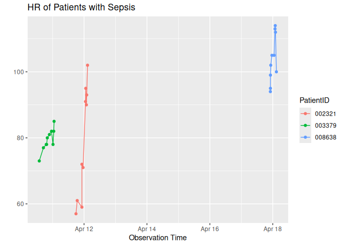

A7 Report
================
Yansong Wen

\##TASK1&2

\#TASK3

\#TASK 4

    [1] "2023-04-11 06:22:22 UTC"

| PatientID |  HR | Temp | Resp |
|:----------|----:|-----:|-----:|
| 003379    |  85 |   NA |   32 |

| PatientID | dHR | dTemp | dResp |
|:----------|----:|------:|------:|
| 000098    |  -5 |    NA |    -4 |
| 000135    |  10 |   0.1 |     0 |
| 000150    |   4 |    NA |     2 |
| 000536    |  NA |    NA |    NA |
| 000958    |  14 |    NA |    -5 |
| 001241    |  -9 |    NA |    -1 |
| 001553    |   0 |   0.1 |     2 |
| 001850    |  NA |    NA |    NA |
| 001903    |  -3 |    NA |    -3 |
| 002116    |  18 |    NA |     1 |
| 002171    |   3 |    NA |    -3 |
| 002247    |  -2 |    NA |     1 |
| 002321    |   0 |    NA |     1 |
| 002480    |  -9 |    NA |    -2 |
| 002819    |  -1 |    NA |     0 |
| 002945    |   0 |    NA |     1 |
| 003379    |   3 |    NA |     7 |
| 004127    |   2 |    NA |     3 |
| 004201    |   1 |    NA |    -1 |
| 004402    |  NA |    NA |    NA |
| 004768    |  NA |    NA |    NA |
| 004772    |  -3 |    NA |    -5 |
| 004902    |  -4 |    NA |     6 |
| 004927    |  10 |    NA |    -3 |
| 004978    |  NA |    NA |    NA |
| 005062    |  -4 |    NA |     2 |
| 005131    |   6 |    NA |     6 |
| 005135    |   3 |    NA |    -1 |
| 005854    |  -1 |    NA |     1 |
| 005858    |  NA |    NA |    NA |
| 005946    |  -4 |    NA |     0 |
| 005980    |  -1 |    NA |    -3 |
| 006349    |   5 |   0.2 |    -1 |
| 006534    |   9 |    NA |    22 |
| 006827    |   0 |  -0.1 |    -1 |
| 006987    |   0 |   0.0 |    -2 |
| 007029    |   2 |    NA |     0 |
| 007041    |   3 |    NA |    -8 |
| 007541    |   0 |    NA |     0 |
| 007567    |  -3 |    NA |     4 |
| 007586    |  -3 |  -0.1 |     1 |
| 007742    |   2 |    NA |    -2 |
| 007753    |   5 |    NA |    -2 |
| 008527    |  -8 |    NA |     1 |
| 008638    |   4 |    NA |     9 |
| 008639    |  -1 |  -0.2 |     2 |
| 008828    |   2 |   0.0 |     1 |
| 009301    |   4 |    NA |     0 |
| 009610    |  13 |    NA |     0 |
| 009821    |   1 |    NA |     1 |

Changes of heart rate, temperature, and respiratory rate for all
patients in the lasted 2 observations
